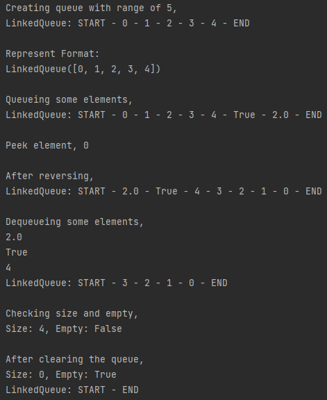

# Linked Queue

## Aim

To implement a queue data structure using linked list.

## Purpose

It is an alternative to array based queue. Also do enqueue() and dequeue() operation in faster way.

## Short description of script

Queue ADT:
- Queue is a linear data structure in which insertion and deletion
performed based on FIFO principle.
- FIFO: First In First Out.

Linked Queue:
- Queue implemented by linked list concept is known as Linked Queue.
- It reduces the complexity in array based queue.
- It manages every enqueue() and dequeue() operation run in O(1) time.


## Workflow of the Project

- Script Contents:
    - Class: LinkedQueue: Manages the queue.
    - Methods:
        - clear(): Clears the queue.
        - dequeue(): Deletes first element of the queue and returns it. 
        - enqueue(): Adds the given element at the end of queue.
        - extend(): Extends the queue with given iterable elements.
        - is_empty(): Tells the queue is empty or not.
        - peek(): Return the first element without deleting it.
        - reverse(): Reverses the queue.
- In our implementation we use head and trail variables that respectively stores header and trailer of linked queue.
- It is used for easy enqueue() and dequeue() operation.
- There is no upper limit condition, because of linked structure.

## Setup instructions

- Import using,
    ```python
    from linked_queue import * 
    ```
    OR
    ```python
    import linked_queue
    ```
- Create a instance,
    ```python
    varible_name = LinkedQueue()
    ```
    OR
    ```python
    varible_name = linked_queue.LinkedQueue()
    ```
- And start work on it.

## Sample Test Cases

```python
>>> from linked_queue import *
>>> q = LinkedQueue(range(1,6))
>>> q
LinkedQueue([1, 2, 3, 4, 5])
>>> print(q)
LinkedQueue: START - 1 - 2 - 3 - 4 - 5 - END
>>> q.reverse()
>>> q
LinkedQueue([5, 4, 3, 2, 1])
>>> len(q)
5
>>> q.enqueue(2.0)
>>> q
LinkedQueue([5, 4, 3, 2, 1, 2.0])
>>> q.dequeue()
5
>>> q
LinkedQueue([4, 3, 2, 1, 2.0])
>>> q.clear()
>>> q
LinkedQueue([])
>>> len(q)
0
```

## Output

- Test case above,  
    

- Test case inside script,  
    
    
    
