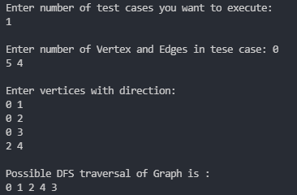

## DFS of Graph
## Problem Link: https://practice.geeksforgeeks.org/problems/depth-first-traversal-for-a-graph/1

- ### Time Complexity: O(V+E)
- ### Auxiliary Space Complexity: O(V)

## Code Snippet:
```cpp
class Solution 
{
    public:
    vector<int> dfsTraversal;
    unordered_map<int, bool> isVisited;
    
    void getDFS(int vertex, vector<vector<int>> &adjList){
        dfsTraversal.push_back(vertex);
        isVisited[vertex] = true;
        
        for(auto x: adjList[vertex]){
            if(isVisited[x] == false)
	            getDFS(x, adjList);
        }
    }

	//Function to return a list containing the DFS traversal of the graph.
	vector<int>dfsOfGraph(int V, vector<int> adj[]){   
	    vector<vector<int>> adjList(V);
	    for(int i = 0; i < V; i++){
	        adjList[i].push_back(i);
	        for(auto x: adj[i])
	            adjList[i].push_back(x);
	    }
	    getDFS(adjList[0][0], adjList);
	    
	    return dfsTraversal;
	}
};
```

## Running Code:

