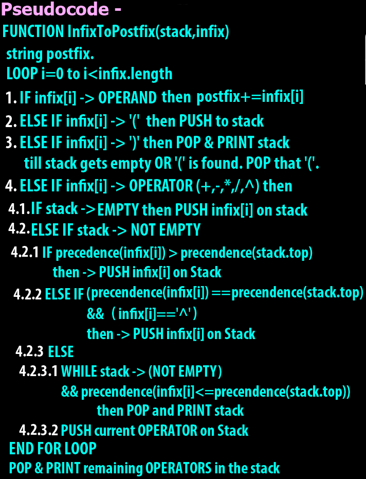

### **Step 1:** [Learn manual conversion of Infix to Postfix/Prefix by GFS.](https://youtu.be/q75VAGSwL0U)

### **Step 2:** [Learn postfix to Infix manually.](https://youtu.be/qqagmeTN0p4?t=1031)

### **Step 3:** [Learn prefix to Infix manually.](https://youtu.be/lT4-mJAF5UA?t=1119)

### **Step 4:** [Learn Rules to convert Infix to postfix using stack.](https://youtu.be/8wQ7JE5pFXU)

### **Step 5:** [Visualize pseudo code to convert Infix to postfix using stack.](https://youtu.be/BeRM6DzdCBg)

### **Step 6:** [Implementation of pseudo code in C++ to convert Infix to postfix using stack.](https://youtu.be/dJESbyFR1sU)

### **Step 7:** [See my code here in Java to convert Infix to postfix using stack.](https://github.com/thepranaygupta/Data-Structures-and-Algorithms/blob/main/02.%20Stack/Infix%20Prefix%20Postfix/01.%20Infix%20to%20Postfix/InfixPostfix.java)

 
<h1 align="Center">Thank You</h1>
