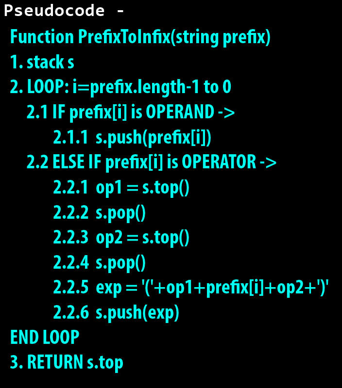

**NOTE:** [You should know Step 3 from here.](https://github.com/thepranaygupta/Data-Structures-and-Algorithms/tree/main/2.%20Stack/Infix%20Prefix%20Postfix/01.%20Infix%20to%20Postfix)

### **Step 1:** [Understand the working of pseudocode](https://youtu.be/sevlImM3Onc)

### **Step 2:** [See my code here in java to convert prefix to infix using stack.](https://github.com/thepranaygupta/Data-Structures-and-Algorithms/blob/main/2.%20Stack/Infix%20Prefix%20Postfix/04.%20Prefix%20to%20Infix/PrefixInfix.java)

 
<h1 align="Center">Thank You</h1>
