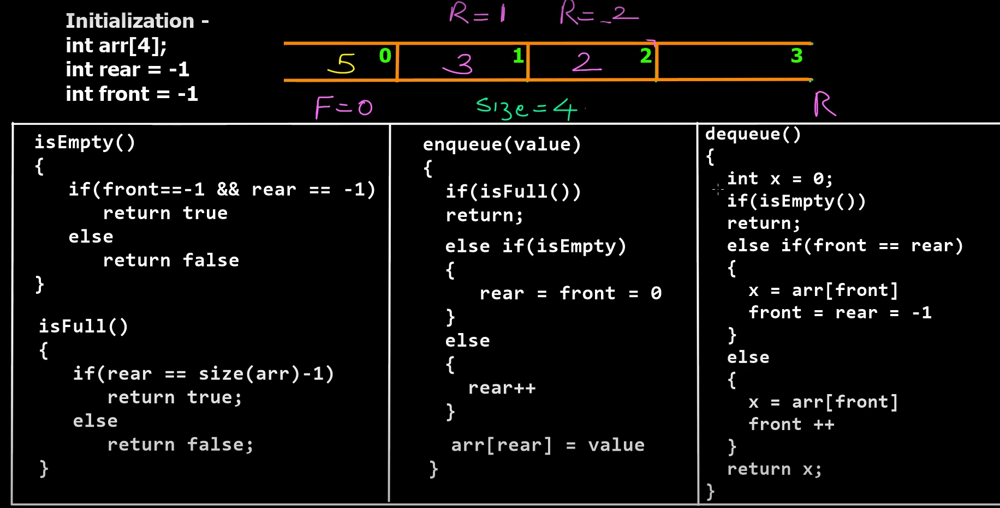

## **Definition:**

Queue is a linear data structure which operates in a **First IN First OUT or Last IN Last OUT.** Queue is an abstract data type with a bounded (predefined) capacity. It is a simple data structure that allows adding and removing elements in a particular order.
**The order is FIFO(First IN First OUT) or LILO(Last In Last Out).**

**It is named queue as it behaves like a real-world queue for examples –**

- queue(line) of cars in a single lane,
- queue of people waiting at food counter etc.

## **Standard Queue Operations:**

- Enqueue() – Add item to the queue from the REAR.
- Dequeue() – Remove item from the queue from the FRONT.
- isFull() – Check if queue is full or not.
- isEmpty() – Check if queue empty or not.
- count() – Get number of items in the queue.
- peek() – return front elemenet in the queue(line).

<h1></h1>

<!--   -->

<h3> <b>Step 1:</b> <a href="https://youtu.be/fbonDkYsKj0">Watch this introductory video on apna college</a>

<h3><b>Step 2:</b> Visualize pseudocode</h3>

<h3></h3>

### **Step 3:** [See my code here in java](./Queue_Array.java)

<h1 align="Center">Thank You</h1>
